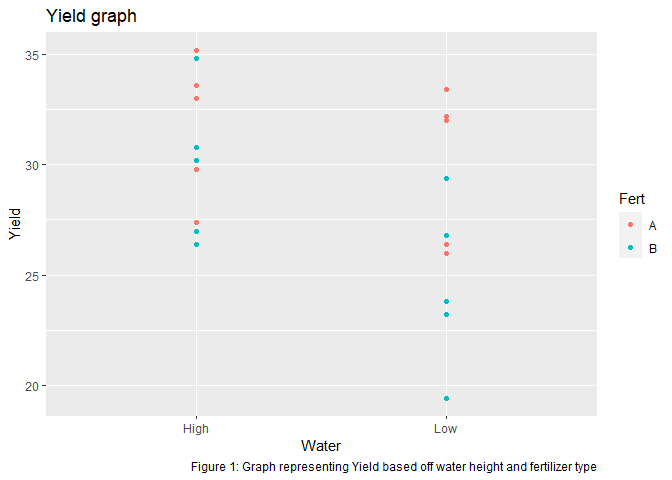

HW1
================
Florian John Date:
2022-11-06

# Summary

In this assignment I will explain my previous experiences with R,
RStudio, R Markdown, Git, Github, ggplot2 and dplyr.

After this i will use ggplot to visualize a data-set fetched from the
internet.

# Task 1

My experiences working with R, RStudio and R Markdown has been limited
to projects assignments associated with a few statistical courses
relating to inference theory and linear-statistical-models. I have
therefore worked with optimization methods, visualizing data and model
selection among other things.

I do not have experience working with Git, Github, ggplot2 and dplyr
however i do know that Github is used during collaborative efforts when
working on code online.

# Task 2

We search for a free data-set online and find a data-set containing
information about yield, fertilizer-type and water height on Github
(link:
<https://raw.githubusercontent.com/Opensourcefordatascience/Data-sets/master/crop_yield.csv>).

Using the link to the raw csv file on github we use the read.csv
function to obtain a dataset which we name df.

We now plot the data using the ggplot function in order to observe the
relations between data in the data-set.

<!-- -->

From figure 1 it seems that yield increases when the water level is
“High” and the Fertilizer type is “A”.

    ## R version 4.2.2 (2022-10-31 ucrt)
    ## Platform: x86_64-w64-mingw32/x64 (64-bit)
    ## Running under: Windows 10 x64 (build 22000)
    ## 
    ## Matrix products: default
    ## 
    ## locale:
    ## [1] LC_COLLATE=English_United States.utf8 
    ## [2] LC_CTYPE=English_United States.utf8   
    ## [3] LC_MONETARY=English_United States.utf8
    ## [4] LC_NUMERIC=C                          
    ## [5] LC_TIME=English_United States.utf8    
    ## 
    ## attached base packages:
    ## [1] stats     graphics  grDevices utils     datasets  methods   base     
    ## 
    ## other attached packages:
    ## [1] ggplot2_3.3.6
    ## 
    ## loaded via a namespace (and not attached):
    ##  [1] highr_0.9        pillar_1.8.1     compiler_4.2.2   tools_4.2.2     
    ##  [5] digest_0.6.30    evaluate_0.17    lifecycle_1.0.3  tibble_3.1.8    
    ##  [9] gtable_0.3.1     pkgconfig_2.0.3  rlang_1.0.6      cli_3.4.1       
    ## [13] DBI_1.1.3        rstudioapi_0.14  yaml_2.3.6       xfun_0.34       
    ## [17] fastmap_1.1.0    withr_2.5.0      stringr_1.4.1    dplyr_1.0.10    
    ## [21] knitr_1.40       generics_0.1.3   vctrs_0.5.0      grid_4.2.2      
    ## [25] tidyselect_1.2.0 glue_1.6.2       R6_2.5.1         fansi_1.0.3     
    ## [29] rmarkdown_2.17   farver_2.1.1     magrittr_2.0.3   scales_1.2.1    
    ## [33] htmltools_0.5.3  assertthat_0.2.1 colorspace_2.0-3 labeling_0.4.2  
    ## [37] utf8_1.2.2       stringi_1.7.8    munsell_0.5.0
